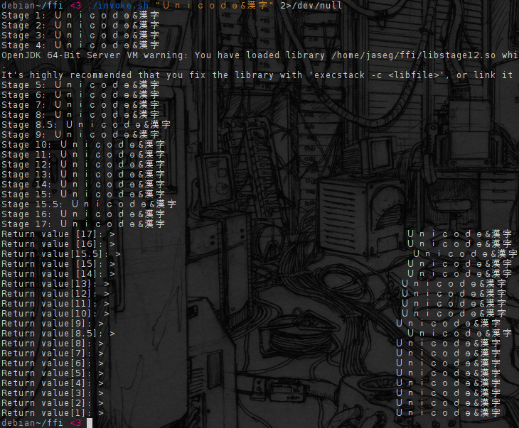

A Foreign Call Through the TIOBE Top 20 and some
================================================

The "and some" being due to TIOBE Top 20 being a shitty index and lacked some of the most interesting languages.

This will probably be almost impossible to reproduce as I did some pretty dirty hacks to make this even work, but I warmly invite you to try. I did all of this on a sort-of up-to-date debian stable with mono, jxcore, postgres and go built from source. The call starts in Java and proceeds through the chain (with highlights such as PL/PGSQL, VisualBasic and bash) and ends up in a kernel module providing the much needed "leftpad" functionality. Pic below.

1. Java (JNI out)
1. C
1. C++
1. Java (JNI in, JNA out)
1. C#
 * Due to two separate segfaulty bugs this needs a *very* recent version of Mono, and needs to be run with sgen, not boem.
1. Python
1. Visual Basic
 * vbnc is kind of unstabley, but generally works fine.
1. Javascript
 * That think needs to be compiled from source to work
1. Perl
1. Ruby
 * Not mruby as I couldn't get mruby to work
1. Delphi
 * Does something that fucks with the jvm enough to make it crash on exit. Thus, we exit a bit harder than normal and everything works again.
1. Assembly
1. Objective C
1. Objective C++
 * Oh god these toolchains
1. R
 * Requires ulimiting the maximum stack size to something like 256MB to work
1. Groovy
 * On first run downloads a bunch of shit from the internet and executes it in the background.
1. Matlab/Octave
1. PL/pgSQL
 * Requires that strange borked postgres build done by the Makefile.
1. Fortran 90
 * Actually quite a neat language!
1. bash
 * Uses ctypes.sh
1. TCL
1. Lua
1. Rust
1. Go
1. Haskell
 * Requires a metric fuckton of libraries spread everywhere, but when invoked with those, works.
1. Linux kernel module via chardev

